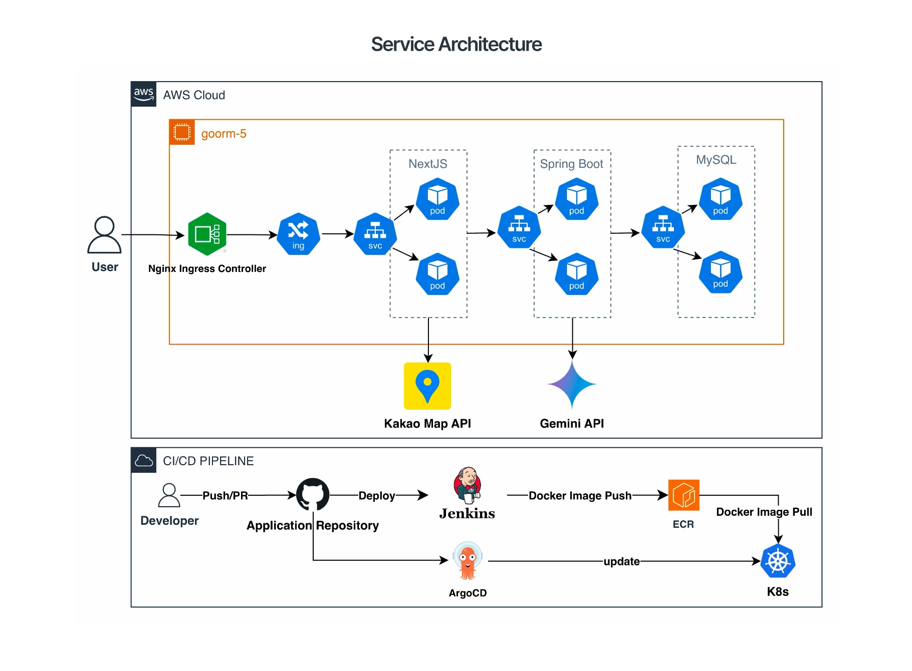

# 🍊 삼춘이랑

> **삼춘** : 제주방언으로 모든 웃어른을 일컫는 말
>
> 제주 독거노인·청년·여행객을 잇는 커뮤니티 매칭 서비스

<a href="https://samchoon-irang.vercel.app/"><b>🌐 Live Demo</b></a>

  

  <b>구름톤 17기 in JEJU | TEAM 마음충전소</b>

1인 노인계층이 전국 대비 높은 제주에서 노인가구 내 여행객에게 제공할 수 있는 여분의 방을
제주로 여행을 온 여행객에게 제주 소지역 경험을 함께 제공해주는
**제주 독거노인과 청년 · 여행객을 잇는 커뮤니티 매칭 서비스**

어르신에게는 따뜻한 동행과 부가 수입을, 여행자에게는 진짜 제주를 선사합니다.

---

## 🌏 Background — 2026년 제주, 초고령 사회 공식 진입

  

- **제주 60세 이상 인구 비율 40%** (10명 중 4명)
- **제주 고독사 연평균 증가율 43.6%**

제주는 구조적 고령화 문제에 직면해 있습니다. 삼춘이랑은 복지 예산에 의존하지 않고, **여행객 수요 기반의 자생적 수익 모델**로 독거노인의 사회적 고립 해소와 지역 경제 활성화를 동시에 실현합니다.

---

## ⚠️ Problem — 제주 지리·문화적 특성에 의한 1인 가구 고립 취약성

  

- **제주도와 육지 간 비연결성** — 육지 내 친척·친구와의 단절
- **마을회관의 낮은 접근성** — 중산간 마을 및 급격한 경사, 교통 취약
- 커뮤니티 시설 접근성과 외부 연결성이 낮아 **일상적 교류가 단절**되는 구조

---

## 👥 User Needs

### 🧓 제주 독거노인 — "남는 공간을 활용해 사람들과 연결되고 싶어요!"

  

| 니즈 | 내용 |
|---|---|
| 🧡 **정서적 니즈** | 1인 가구 중심으로 생활하며 일상적 교류 부족, 외로움 해소 욕구 |
| 💰 **경제적 니즈** | 고정 수입이 제한적인 상황에서 유휴공간을 통한 부수적 수입 창출 |
| 🏠 **공간 활용 니즈** | 주거 내 2~3개의 방을 보유하지만 대부분 유휴공간으로 존재 |
| 📊 **주거 구조적 특징** | 1인 가구의 80% 이상이 과소밀 상태, 낮은 활용도 |

### 🧑‍🎒 여행자 — "흔한 관광지가 아니라 제주의 로컬 고유문화를 알고싶습니다!"

  

| 니즈 | 내용 |
|---|---|
| 🗺️ **기존과 다른 형태의 제주 여행 니즈** | 붐비는 일반 여행지와 다른, 조용하게 여행하고자 하는 욕구 |
| 💸 **합리적인 여행 소비 니즈** | 높아진 여행 비용 문제에 대한 합리적 대안 수요 |
| 🌿 **정서적 안정 기지 및 휴식 니즈** | 잔잔한 대화와 조용한 곳에서 마음을 치유받고자 하는 청년들 |

---

## 💼 Business Modelling

  

- **독거노인** — 방과 체험 콘텐츠 제공 → 수익 창출
- **여행자** — 저렴하고 특별한 로컬 숙박 경험
- **지자체** — 삼춘 등록 및 예약 관리 지원, 관광 상품 확보

---

## 🔄 Service Flow — 여정의 시작부터 따뜻한 기록까지

  

| 단계 | 독거노인 | 여행객 |
|:---:|:---|:---|
| **(1) 준비** | 여행객 ↔ 제주 독거노인 매칭 | 매칭 |
| **(2) 시작** | 여행객과 함께 교류 | 독거노인의 집에서 여행 |
| **(3) 경험** | 지식과 경험 나눔 | 특별한 로컬 경험 |
| **(4) 결과** | 🧡 외로움 해소 + 소득 창출 | 🍊 나만의 제주 여행 |

---

## ✨ Expectation Effectiveness — 기대 효과

  

| 🧓 독거노인 | 🧑‍🎒 여행자 | 🏛 지자체 |
|:---|:---|:---|
| 1. 경제적 자립 + 심리적 자립 | 1. 적은 비용으로 깊은 만족감 | 1. 돌봄 및 구조 비용 예방 |
| 2. 잠재적 독거노인 방지 | 2. 제주 재방문 가능성 상승 | 2. 사회적 자본 이론 |
| 3. 건강과 생산성 유지 |  | 3. 경제규모 확장 |

> *Connecting Generations in Senior Housing: A Guidebook for Building an Intergenerational Culture*

---

## 🏗 Service Architecture

  

### Tech Stack

| 구분 | 사용 기술 |
|---|---|
| **Frontend** | Next.js |
| **Backend** | Spring Boot |
| **Database** | MySQL |
| **Infra** | AWS Cloud, Kubernetes (K8s), Nginx Ingress Controller |
| **CI/CD** | GitHub, Jenkins, ArgoCD, ECR |
| **External API** | Kakao Map API, Gemini API |

### Frontend 상세

- **NextJS** : App Router 방식의 직관적인 페이지 구조로 효율적인 라우팅 구현
- **Typescript** : 타입 안정성이 보장된 개발 환경 구축
- **TanStack Query** : 서버 상태 캐싱/재조회 관리 (QueryClient Provider 세팅 완료)
- **Zustand** : 즐겨찾기 / 사용자 정보 등 전역 상태를 전역적으로 관리, 불필요한 props 전달 제거
- **Web API - LocalStorage** : 첫 스플래시 페이지가 반복적으로 노출되는것을 방지하기 위해 브라우저 저장소 활용
- **Vapor UI + inline style 기반 반응형 디자인 시스템** : 디자이너의 피그마 컴포넌트와 프론트엔드 개발자의 리액트 컴포넌트 연동하여 빠른 개발 생산성
- **Open API Generator** : Swagger JSON 파일 기반으로 백엔드 API 호출 로직 자동 생성
- **SSG** : 50개 숙소 상세 페이지를 빌드 타임에 정적 HTML로 프리렌더링 → 초기 로딩 속도 최적화
- **Metadata API** : 페이지별 동적 메타데이터로 링크 공유 시 숙소 정보 미리보기 제공
- (외부) **Kakao Map API** : 제주도 지도 내 홈스테이 가능한 노인의 집들을 보여주기위해 사용
- **(후속) Mock API Layer** : 환경변수(`NEXT_PUBLIC_USE_MOCK`) 기반 스위치로 백엔드 종속성 없이 프론트엔드 배포 가능
- **(후속) Vercel** : GitHub 연동 자동 배포 및 Preview 배포 환경 구성

---

## 📱 App Screens

### 1️⃣ Splash & Onboarding — 제주 삼춘과 청년의 따뜻한 동행, 그 첫 시작

  

낯선 여행지에서 따뜻한 정을 나누는 '삼춘이랑'의 첫인상입니다. 어르신과 청년이 교감하는 모습을 일러스트로 담아, 앞으로의 펼쳐질 제주에서의 특별한 여정에 대한 기대감을 디자인합니다.

### 2️⃣ Main Page — 내 취향에 맞는 '삼춘' 검색부터 간편한 예약까지

  

삼춘이 제공하는 특별한 경험을 직관적인 태그로 확인하고, 방명록을 읽으며 쉽고 빠르게 예약을 진행할 수 있습니다.

### 3️⃣ Map Page — 지도로 한눈에 찾는 제주 전역의 삼춘 숙소

  

지도 위 핀(Pin)과 맞춤형 필터(가까운 거리, 인기 순 등)를 활용해 원하는 지역의 호스트를 직관적으로 탐색할 수 있습니다. 내 여행 동선에 맞는 숙소를 빠르게 찾고 예약할 수 있습니다.

### 4️⃣ Archive — 여정 이후의 경험을 기록하는 사진 및 텍스트 아카이브

  

이용이 완료된 예약 건에 대해 방문객이 직접 추억을 기록할 수 있습니다. 작성된 사진과 글은 갤러리 형태로 아카이빙되어 마이페이지에서 언제든 확인할 수 있습니다.

---

## 🎬 Demo & Live

### 시연 영상

https://github.com/user-attachments/assets/54b8214b-158f-4ab9-a729-f44279502c54

### 배포 링크

<table>
  <tr>
    <td align="center">
      
       
      <b>📱 QR 코드로 접속하기</b>
    </td>
    <td align="center">
      <h3>🌐 Live Demo</h3>
      <a href="https://samchoon-irang.vercel.app/">
        <b>https://samchoon-irang.vercel.app/</b>
      </a>
        
      모바일 환경에 최적화된 서비스입니다. 
      데스크톱 접속 시 개발자 도구의 모바일 뷰를 권장드립니다.
    </td>
  </tr>
</table>

---

## 👨‍👩‍👧‍👦 Team — 마음충전소

<table>
  <tr>
    <td>
      
    </td>
    <td>
      <table>
        <thead>
          <tr>
            <th align="center">역할</th>
            <th align="center">이름</th>
            <th align="center">링크</th>
          </tr>
        </thead>
        <tbody>
          <tr>
            <td align="center"><b>PM</b></td>
            <td align="center">류충모</td>
            <td align="center"><a href="https://aaronryu.notion.site/resume">Notion</a></td>
          </tr>
          <tr>
            <td align="center"><b>UI/UX</b></td>
            <td align="center">오민주</td>
            <td align="center"><a href="https://www.behance.net/omj0433">Behance</a></td>
          </tr>
          <tr>
            <td align="center"><b>BE</b></td>
            <td align="center">이정민</td>
            <td align="center"><a href="https://github.com/wjdalsdk70">GitHub</a></td>
          </tr>
          <tr>
            <td align="center" rowspan="2"><b>FE</b></td>
            <td align="center">김서희</td>
            <td align="center"><a href="https://github.com/suki186">GitHub</a></td>
          </tr>
          <tr>
            <td align="center">조영찬</td>
            <td align="center"><a href="https://github.com/ychany">GitHub</a></td>
          </tr>
        </tbody>
      </table>
    </td>
  </tr>
</table>

---

  <b>🍊 제주의 온기를 잇는 따뜻한 연결, 삼춘이랑 🍊</b> 
  9oormthon 17th · Team 마음충전소

